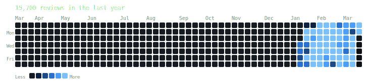

# AnkiDailyReviews

A script that generates a GitHub contribution graph-style heatmap of your Anki daily card reviews as an SVG.



## Usage

```bash
python3 generate_heatmap.py
```

The script reads from the default Anki database path on macOS and writes `heatmap.svg` next to the script.

### Options

| Flag | Default | Description |
|------|---------|-------------|
| `--db PATH` | `~/Library/Application Support/Anki2/User 1/collection.anki2` | Path to Anki collection |
| `--out PATH` | `heatmap.svg` (next to script) | Output SVG path |

## Requirements

- Python 3 (stdlib only — no dependencies)
- Anki installed with a local collection

## Platform support

| Platform | Default DB path |
|----------|----------------|
| macOS | `~/Library/Application Support/Anki2/User 1/collection.anki2` |
| Windows | `%APPDATA%\Anki2\User 1\collection.anki2` |

If your collection is in a non-standard location, use `--db PATH`.

## How it works

- Reads review history directly from Anki's SQLite database (`revlog` table)
- Respects your configured rollover hour so early-AM reviews count under the correct date
- Displays the last 53 weeks in a Sun–Sat grid
- Blue color scale, new shade every 50 cards

## Embedding in a README

Commit `heatmap.svg` to your repo, then reference it via raw URL:

```markdown

```
